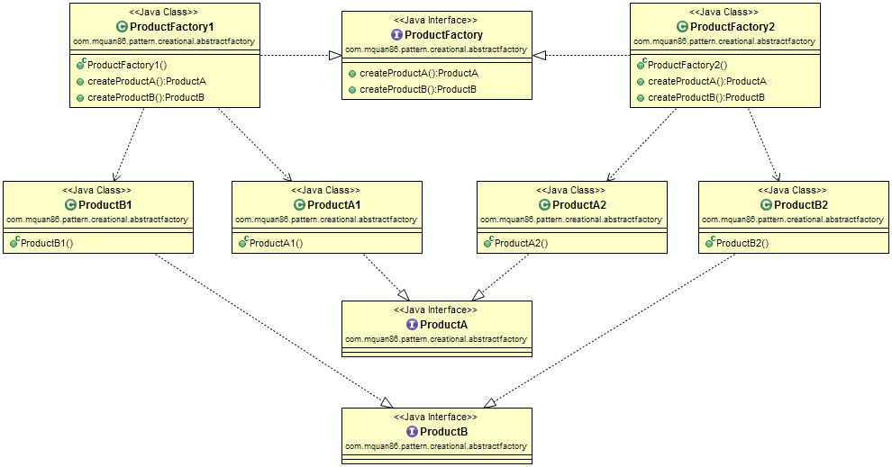
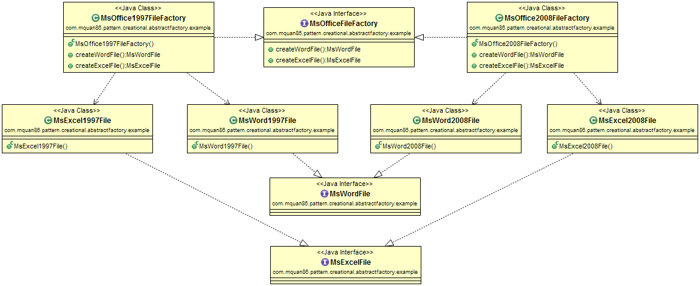

# Abstract Factory

## Pattern
Add an abstract layer for Factory pattern. Simply is factory of factories.

Recognized by creational method returns a factory.

## Example
Our application can create Microsoft Word and Excel, user can choose between 1997 format or new 2008 format. So depend on user choice, the equivalent office format factory will return.

