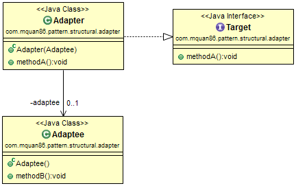
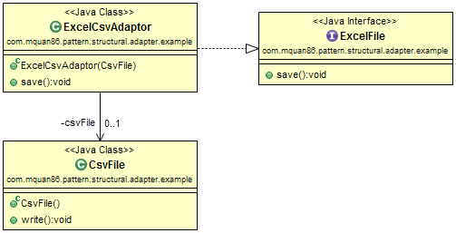

# Pattern
Reuse an existing class that is not compatible with current system interface.

Recognized by a method takes an incompatible object but return a compatible instance.

# Example
Our application has ability to save Excel file. We want to improve it by support CSV format. There is a open source class for handle CSV, but it is not compatible with our interface. We can use Adapter pattern to reuse it without rewrite them.

