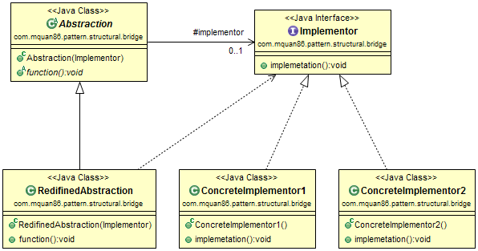
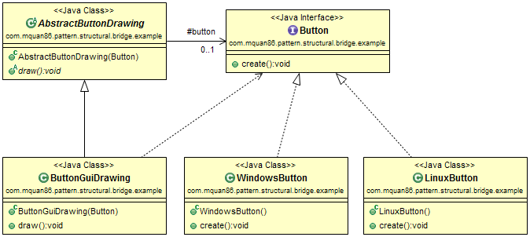

# Bridge

## Patteren
Decouple an abstraction from its implementation so that the two can vary independently. 

Recognized by an abstraction structure object between implementations.

## Example
Our application is a cross-platform application. It works on both Windows and Linux. Therefore, our button drawing API must be independent from the OS implementation.

