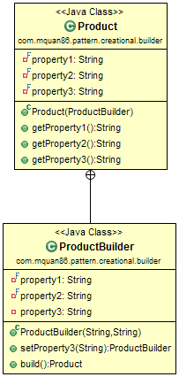
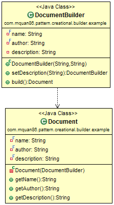

# Pattern
Separate the construction of complex object. The object will be build as parts, then final will return the completion initialized object.

Recognized by creational method returns an instance object.

This pattern is a little bit different from the Builder pattern in GoF book. This pattern comes from "_Effective Java_" book. It is good for reduce the complex constructors, improve the readable and writeable of code, also ensure the complete state of object. But the downside is duplication properties and more code.

There is a improvement pattern of this, [Step Builder](./Step-Builder.md) which guarantee step by step build of a object.

# Example
A complex object such as document file will have many properties to be initialized. If we use the normal constructor there will too much constructors and parameters. Therefore we can use builder to build a basic object with required/important properties first, we can add others optional properties later and build a complete object final.

