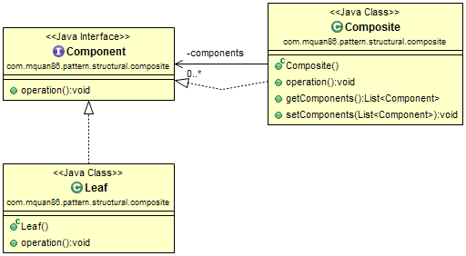
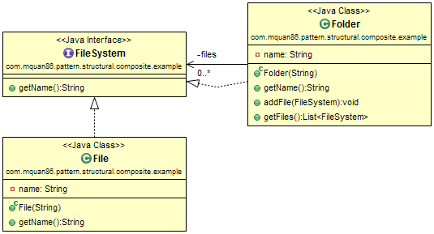

# Composite

## Pattern
Compose objects into tree structure.

Recognized by method takes an object of the same abstract type add into tree structure.

## Example
Build structure tree of files and folders.

