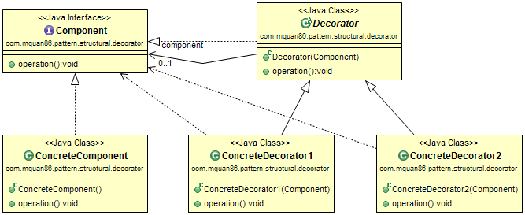
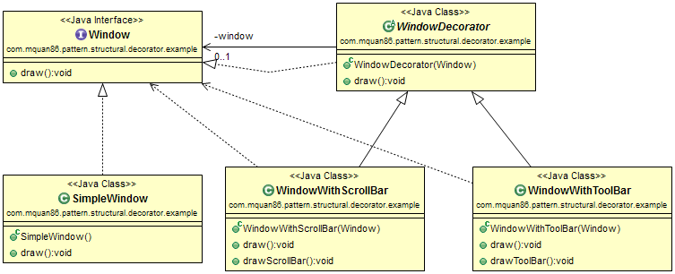

# Decorator

## Patteren
Add additional features to existing object dynamically.

Recognized by method takes the same abstract type which adds additional feature.

## Example
A window GUI instance may have scrollbar or toolbar dynamically.  

