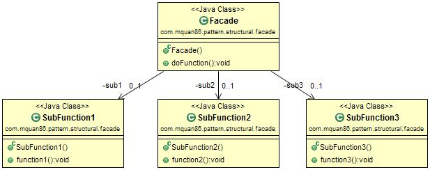
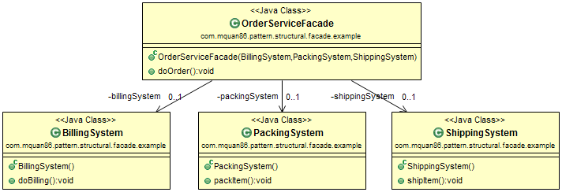

# Facade

## Patteren
Hide the complexity of system by providing simple unified interface system for a set of interfaces.

Recognized by the function internally uses different interface types.

## Example
A complex shopping order system uses different sub system for packing, billing, shipping

