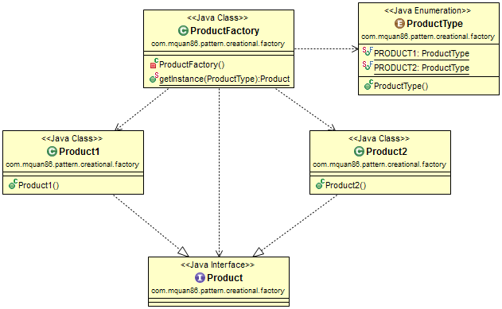
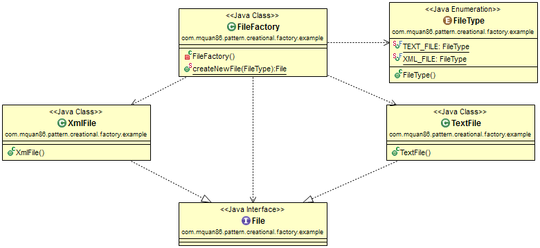

# Factory Method

## Pattern
Create a object type base on the parameter type given.

Recognized by creational method return the different object implementation of abstract type based on given parameter.

## Example
A factory to create a new plain text file or Xml file type based on user parameter input.

