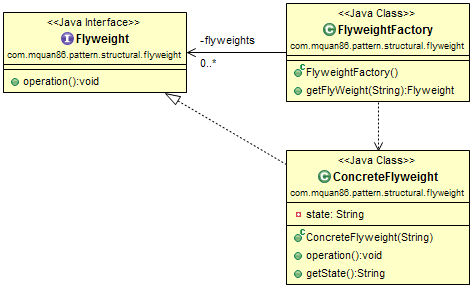

# Flyweight

## Pattern
Sharing similar object for minimizing memory usage or for effectily.

Recognized by the method returns a cached object.

## Example
Your application is a text editor, you must draw characters as it's font style. Assume that font style for every character is complex and should not be reload every time you use it. You can use Fly Weight pattern to cache that character instance. 

