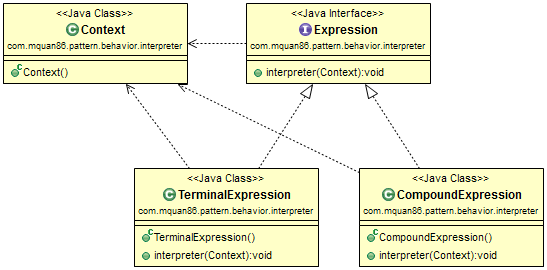

# Interpreter

## Patteren
Represent for grammar language rule, specify how to evaluate the expression. The syntax of grammar language usually present by a tree of expressions by composite pattern. The expression could be a single node (terminal expression) or a composite of others expression (compound expression)

## Example

