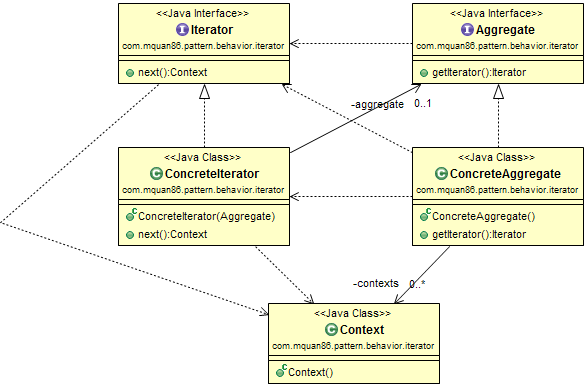

# Iterator

## Patteren
Provide access through the elements of a container. 

## Example
The collection in Java has it's own iterator with interface [java.util.Iterator<E>](https://docs.oracle.com/javase/8/docs/api/java/util/Iterator.html).
