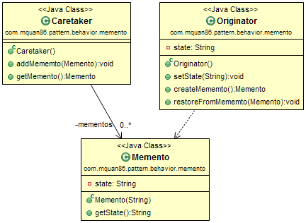
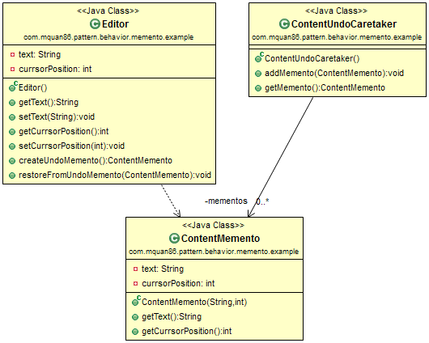

# Pattern
Provide ability to restore an object to it's previous state.

# Example
The editor application store text content and currsor position. Memento pattern provides an undo ability for editor.

