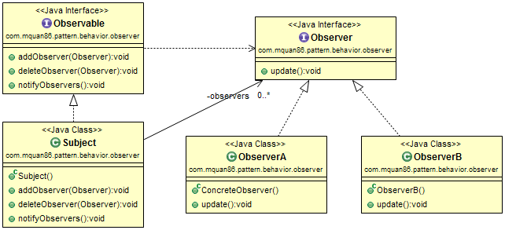
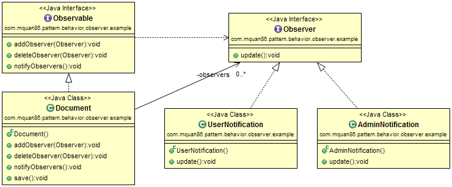

# Pattern
A one to many relationship between objects to notify them about state change in one object.
Usually used in event/listener handling.

Recognized by method notifies state change to another instances.

# Example
A document repository application could notify related users and admins about document state change on saving action.

