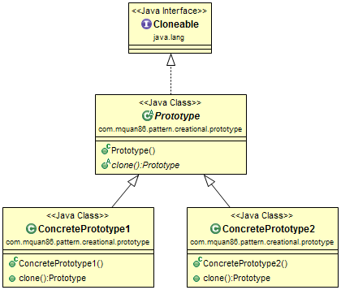
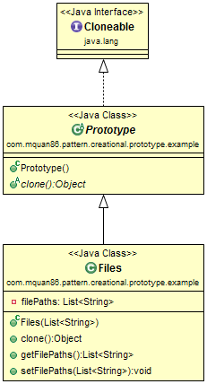

# Pattern
Use to create new object copy from itself.

Recognized by the creational method returns a copy instance of itself. 

# Example
You have a list file name which you want modified, but you want a backup copy of it before modified. If you create a new one, it may take times to get the list file name again (from database or scan system again). Therefore you can make a copy of it.

