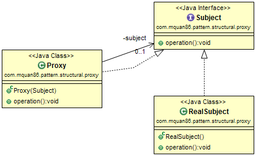

# Proxy

## Patteren
Provide a surrogate or holder of another object to control access to it.

## Example
Your application need to be audit on delete document action, but you have to limit change to current code.

## Note
There is a better built-in implementation of this pattern in JDK at: [java.lang.reflect.Proxy](http://docs.oracle.com/javase/8/docs/api/java/lang/reflect/Proxy.html)