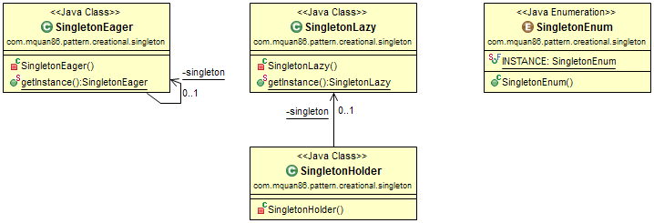
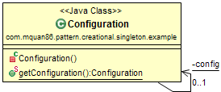

# Pattern
Ensure that a class only have one instance at anytime.

Recognized by a method always returns the same object instance every time.

There a three common and effective implementation for this pattern in Java:

1. **Eager**: Use static initialization to ensure one instance. It is eager initialization, so it could be bad if the object too heavy.
1. **Lazy**: Similar to Eager, but there is a holder to hold instance to avoid eager initialization. Instance only is created whenever the get instance method is called.
1. **Enum**: This is a trick way use Enum type to ensure one instance and simple implementation. This style is introduce in "_Effective Java_" book

#Example
An application must have only one Configuration instance at anytime.

