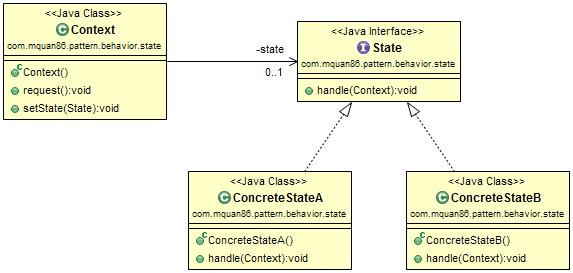
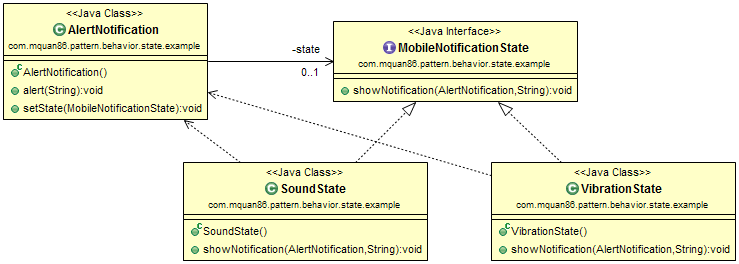

# State

## Pattern
To change the behavior of object if it's internal state is changed.

Recognized by behavior method which is changes behavior depending on instance's state.

## Example
A mobile alert notification alert the notification different way base on mobile's notification state it is. If it is sound mode, notification is showed with sound. If it is vibration mode, notification is showed with vibration and no sound. 

## Downside
Some operations may not be available on some certain states. This could be solved by using separated role interface for state.
