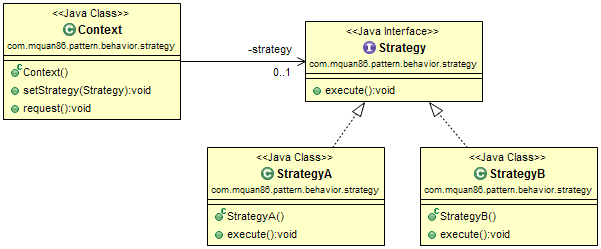
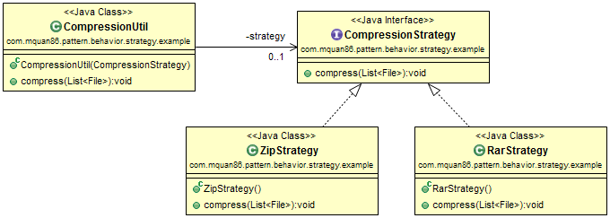

# Pattern
Define set of encapsulate algorithm which is interchangeable to be independent from client use.

Recognized by behavior method execute method of a strategy type passed to it.

# Example
A compression utility can accept two kind of strategy such as ZIP or RAR format compression.

# Note
State and Strategy in generally is similar with the same implementation but they solve different problems. State encapsulate state behavior, strategy deal with how a task is perform or encapsulate algorithm.