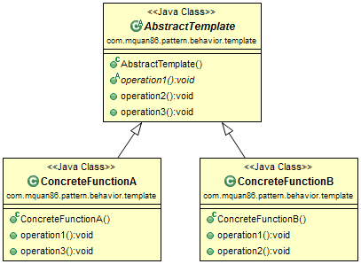
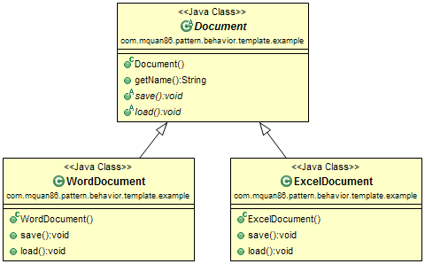

# Pattern
Define a skeleton on abstraction,  then some steps will be defined or overrided in subclass without changing it's structure.

# Example
Word and Excel document have the same way to get the name of document, so it has the common method in Document abstract class. But save and load action are different, hence they are implemented later by it's type. 

