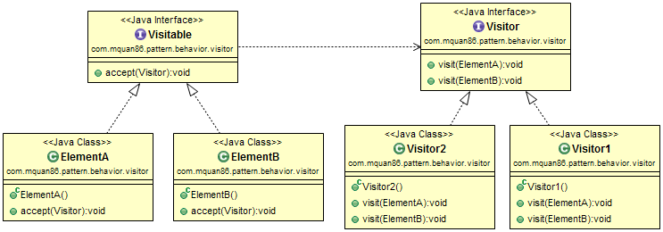
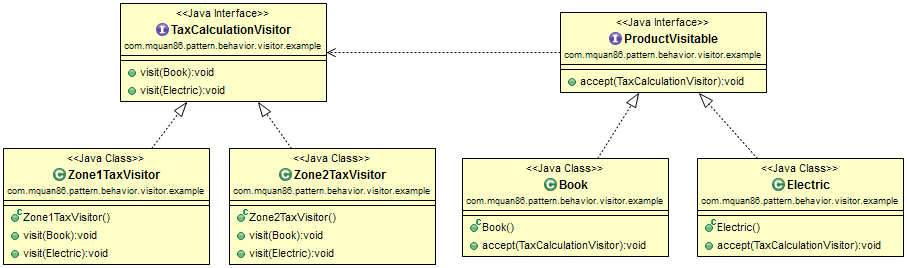

# Pattern
To separate algorithm from object structure, result is new operations can be added without modifying object structure. 

# Example
A tax calculation system for every zone of country based on product may be changed at any time. Visitor pattern can apply for this sistuation.

# Note
There are some complaints about the complicated and hard to understand on this pattern. One of their improvement idea is remove accept method and use only visit method directly. 